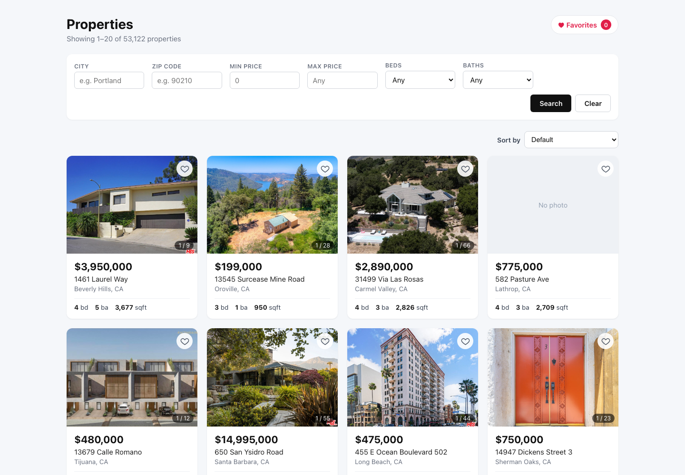
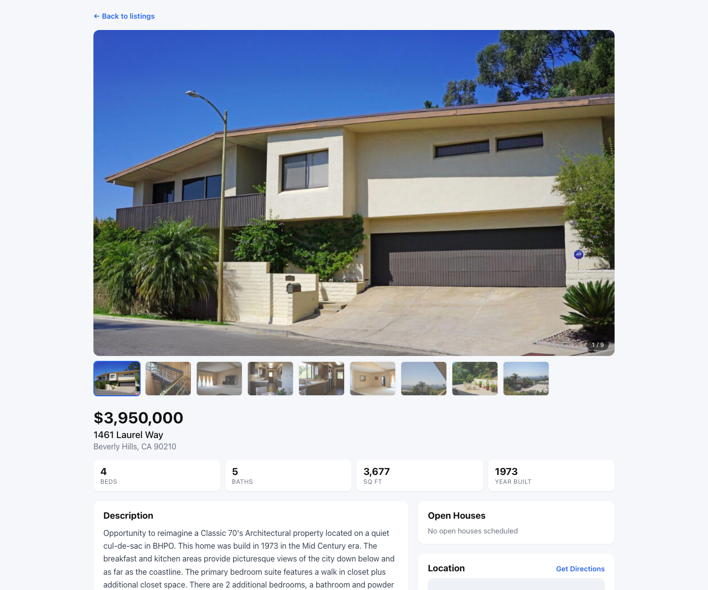

# IDX Exchange — Property Listings

A full-stack real estate listings application. MLS/RETS-shaped property data is
served from MySQL through a Node/Express API and rendered by a React frontend
with search, filtering, sorting, favorites, photo galleries, maps, and open
house schedules.



<details>
<summary>Property detail page</summary>



</details>

## Features

- **Browse & filter** 53,000+ listings by city, zip, price range, beds and baths
- **Sort** by price, date listed, square footage or bedrooms, in either direction
- **Paginate** with a fixed-width page control
- **Property detail pages** with a photo gallery + lightbox, Google map, and open houses
- **Favorites** saved to `localStorage` via a custom `useFavorites` hook, with a dedicated view
- **Photo carousels** on every card, parsed from the MLS `L_Photos` JSON column
- **Error boundary** so a render failure shows a recovery UI instead of a blank page

## Tech stack

| Layer | Technology | Version |
| --- | --- | --- |
| Runtime | Node.js | 22.20.0 (18+ works) |
| Database | MySQL (Docker) | 9.7.1 |
| API | Express | 5.2.1 |
| DB driver | mysql2 | 3.22.5 |
| Frontend | React | 19.2.7 |
| Routing | react-router-dom | 7.18.2 |
| Build tool | Vite | 8.1.1 |
| Frontend tests | Vitest + Testing Library | 4.1.10 |
| Backend tests | Jest + Supertest | 30.5.1 / 7.2.2 |
| Linting | oxlint | 1.71.0 |

> **Note:** the container runs MySQL **9**, not 8. This matters in one place:
> MySQL 8.4+ changed `EXPLAIN`'s default output to tree format, so
> `EXPLAIN FORMAT=TRADITIONAL` is required to get the classic table.

---

## Local setup

From a fresh machine. Expect about 10 minutes, most of it importing the dumps.

### Prerequisites

- **Node.js 18+** — `node --version`
- **Docker Desktop**, running
- The two SQL dumps: `rets_property.sql` and `rets_openhouse.sql`

### 1. Clone

```bash
git clone <your-repo-url>
cd IDX-Exchange-SDE-Intern-s26
```

### 2. Start MySQL

```bash
docker run -d --name idx-mysql-local \
  -e MYSQL_ROOT_PASSWORD=root \
  -e MYSQL_DATABASE=rets \
  -p 3306:3306 mysql:9
```

Wait for it to finish initialising (about 20 seconds):

```bash
docker exec idx-mysql-local mysqladmin ping -uroot -proot --silent && echo "ready"
```

### 3. Import the data

```bash
docker exec -i idx-mysql-local mysql -uroot -proot rets < rets_property.sql
docker exec -i idx-mysql-local mysql -uroot -proot rets < rets_openhouse.sql
```

Verify — you should see 53,122 and 4,282:

```bash
docker exec -i idx-mysql-local mysql -uroot -proot rets \
  -e "SELECT (SELECT COUNT(*) FROM rets_property) AS properties,
             (SELECT COUNT(*) FROM rets_openhouse) AS open_houses;"
```

### 4. Configure the backend

Create `backend/.env` (git-ignored — never commit it):

```bash
cat > backend/.env <<'EOF'
PORT=5001

DB_HOST=127.0.0.1
DB_PORT=3306
DB_USER=root
DB_PASSWORD=root
DB_NAME=rets
DB_CONNECTION_LIMIT=10
EOF
```

### 5. Configure the frontend (optional — map only)

The app runs fine without this; the map area shows a hint instead of an iframe.

1. Go to [console.cloud.google.com](https://console.cloud.google.com), create a project
2. Enable **Maps Embed API** under *APIs & Services → Library*
3. Create an API key under *APIs & Services → Credentials*
4. Restrict it to `localhost:3000` and the Maps Embed API only

```bash
cp frontend/.env.example frontend/.env
# then edit frontend/.env and paste your key
```

> Vite only exposes variables prefixed `VITE_`. `REACT_APP_` also works here
> because `vite.config.js` sets `envPrefix: ['VITE_', 'REACT_APP_']`, but
> `VITE_GOOGLE_MAPS_API_KEY` is the idiomatic name. **Restart the dev server
> after editing `.env`** — env vars are not hot-reloaded.

### 6. Install and run

Two terminals:

```bash
# Terminal 1 — API on http://localhost:5001
cd backend && npm install && npm run dev
```

```bash
# Terminal 2 — app on http://localhost:3000
cd frontend && npm install && npm run dev
```

Open **http://localhost:3000**.

### 7. Verify it works

```bash
curl http://localhost:5001/api/health
# {"status":"ok","database":"connected"}
```

Vite proxies `/api` to port 5001, so the frontend needs no CORS setup or base URL.

---

## Testing

```bash
cd backend  && npm test          # 68 tests
cd frontend && npm test          # 140 tests
```

With coverage:

```bash
cd backend  && npm run test:coverage
cd frontend && npm run test:coverage
```

Current coverage (thresholds fail the build below 70%):

| | Statements | Branches | Functions | Lines |
| --- | --- | --- | --- | --- |
| **Backend** (routes, middleware, app) | 100% | 100% | 100% | 100% |
| **Frontend** (`src/`, excluding entry point) | 95.9% | 88.5% | 96.2% | 98.4% |

Backend tests mock the MySQL pool at the module boundary, so **no database is
needed to run them**.

Linting:

```bash
cd frontend && npm run lint      # oxlint, passes clean
```

---

## API reference

Base URL: `http://localhost:5001`. All responses are JSON. Errors use the shape
`{ "error": "message" }`.

### `GET /api/properties`

Paginated, filterable, sortable list of properties.

| Parameter | Type | Default | Notes |
| --- | --- | --- | --- |
| `limit` | integer 1–100 | `20` | Page size |
| `offset` | integer ≥ 0 | `0` | Rows to skip |
| `city` | string ≤ 100 | — | Case-insensitive exact match |
| `zipcode` | string ≤ 20 | — | Exact match |
| `minPrice` | integer ≥ 0 | — | Inclusive |
| `maxPrice` | integer ≥ 0 | — | Inclusive; must be ≥ `minPrice` |
| `beds` | integer 0–50 | — | Exact match |
| `baths` | integer 0–50 | — | Exact match |
| `sortBy` | `price` \| `date` \| `sqft` \| `beds` | — | Anything else → 400 |
| `sortOrder` | `asc` \| `desc` | `asc` | Requires `sortBy` |

**Example request**

```bash
curl "http://localhost:5001/api/properties?city=Beverly%20Hills&minPrice=1000000&sortBy=price&sortOrder=desc&limit=1"
```

**Example response** `200 OK`

```json
{
  "total": 284,
  "limit": 1,
  "offset": 0,
  "sortBy": "price",
  "sortOrder": "desc",
  "results": [
    {
      "id": 13129,
      "listingId": "1089818373",
      "address": "1261 Angelo Drive",
      "city": "Beverly Hills",
      "state": "CA",
      "zipcode": "90210",
      "price": 135000000,
      "beds": 16,
      "baths": "27.0",
      "sqft": 50000,
      "photos": "[\"https:\\/\\/api.cotality.com\\/trestle\\/Media\\/...\"]",
      "yearBuilt": 2012,
      "status": "Active",
      "listedDate": "2024-10-08T05:00:00.000Z"
    }
  ]
}
```

`total` is the count **before** `limit`/`offset`, so the client can compute page
count. `photos` is a JSON **string** the client parses — see
[Known issues](#known-issues).

**Errors**

| Status | Cause | Body |
| --- | --- | --- |
| 400 | `limit` outside 1–100 | `{"error":"limit must be <= 100"}` |
| 400 | `minPrice` > `maxPrice` | `{"error":"minPrice cannot exceed maxPrice"}` |
| 400 | Unknown `sortBy` | `{"error":"sortBy must be one of: price, date, sqft, beds"}` |
| 400 | `sortOrder` without `sortBy` | `{"error":"sortOrder requires sortBy"}` |
| 500 | Database failure | `{"error":"Internal server error"}` |

### `GET /api/properties/:id`

One property as the **raw MLS row** — 126 columns, original column names (the
list endpoint's friendly aliases are not applied here).

**Example request**

```bash
curl "http://localhost:5001/api/properties/53"
```

**Example response** `200 OK` (abridged)

```json
{
  "id": 53,
  "L_ListingID": "1118422731",
  "L_Address": "1461 Laurel Way",
  "L_City": "Beverly Hills",
  "L_State": "CA",
  "L_Zip": "90210",
  "L_SystemPrice": 3950000,
  "L_Keyword2": 4,
  "LM_Dec_3": "5.0",
  "LM_Int2_3": 3677,
  "YearBuilt": 1973,
  "L_Status": "Active",
  "LMD_MP_Latitude": "34.099106000000000",
  "LMD_MP_Longitude": "-118.418132000000000"
}
```

**Errors**

| Status | Cause | Body |
| --- | --- | --- |
| 400 | Non-integer / out-of-range id | `{"error":"id must be an integer"}` |
| 404 | No such property | `{"error":"Property with id 999999 not found"}` |

### `GET /api/properties/:id/openhouses`

Open houses for a property, oldest first. Returns `[]` (not a 404) when the
property exists but has none.

**Example request**

```bash
curl "http://localhost:5001/api/properties/13587/openhouses"
```

**Example response** `200 OK`

```json
[
  {
    "id": 1966,
    "listingId": "1077426281",
    "date": "2026-06-16T05:00:00.000Z",
    "startTime": "09:00:00",
    "endTime": "23:00:00",
    "startDate": "2026-06-16T05:00:00.000Z",
    "endDate": "2026-06-16T05:00:00.000Z",
    "rawData": "{\"SourceSystemKey\":\"153352801\",\"OpenHouseRemarks\":\"This Beautiful Family Home is Move In Ready\", ...}"
  }
]
```

`rawData` is the `all_data` column: a JSON blob of ~47 fields. **Open house
remarks exist only inside it** — there is no dedicated column — so the client
parses `rawData` and reads `OpenHouseRemarks`.

**Errors**

| Status | Cause |
| --- | --- |
| 400 | Invalid id |
| 404 | Property does not exist |

### `GET /api/health`

```bash
curl "http://localhost:5001/api/health"
# {"status":"ok","database":"connected"}
```

Returns `500` with `{"status":"error","database":"disconnected"}` if the pool
cannot reach MySQL.

---

## Database schema

Two tables, imported from MLS/RETS exports. There is **no foreign key** between
them — they are joined on the listing id string.

```
rets_property (53,122 rows)          rets_openhouse (4,282 rows)
─────────────────────────────        ─────────────────────────────
id            PK                     id             PK
L_ListingID   ────────────────────►  L_ListingID    (join key, not a FK)
L_Address                            OpenHouseDate
L_City                               OH_StartTime
L_Zip                                OH_EndTime
L_SystemPrice                        OH_StartDate
L_Keyword2       (beds)              OH_EndDate
LM_Dec_3         (baths)             all_data       (JSON blob, holds remarks)
LM_Int2_3        (sqft)
YearBuilt
L_Status
L_Photos         (JSON array string)
ListingContractDate
LMD_MP_Latitude
LMD_MP_Longitude
… 126 columns total
```

### Column name mapping

MLS column names are opaque, so the list endpoint aliases them. Sorting and
filtering must use the **physical** name:

| Meaning | Physical column | API alias |
| --- | --- | --- |
| Listing id | `L_ListingID` | `listingId` |
| Price | `L_SystemPrice` | `price` |
| Bedrooms | `L_Keyword2` | `beds` |
| Bathrooms | `LM_Dec_3` | `baths` |
| Square feet | `LM_Int2_3` | `sqft` |
| Date listed | `ListingContractDate` | `listedDate` |
| Photos | `L_Photos` | `photos` |

There is **no `L_ListingDate` column** — `ListingContractDate` is the listing
date (100% populated; `OnMarketDate` exists but has 3 nulls).

### Indexes

Composite indexes follow the rule *equality columns first, range column last*,
because MySQL can only use a left-hand prefix of an index:

- `idx_property_city_price (L_City, L_SystemPrice)`
- `idx_beds_baths_price (L_Keyword2, LM_Dec_3, L_SystemPrice)`
- `idx_zip_price (L_Zip, L_SystemPrice)`
- plus single-column indexes on city, zip, price, beds, baths

See [docs/PERFORMANCE.md](docs/PERFORMANCE.md) for the `EXPLAIN` analysis, and
run `cd backend && npm run perf` to reproduce the measurements.

---

## Project structure

```
backend/
  app.js                  Express app (exported, does not listen — see note below)
  server.js               Starts the HTTP listener
  db.js                   mysql2 connection pool
  routes/properties.js    All three property endpoints + validation
  middleware/
    requestLogger.js      One log line per request, with sub-ms timing
  scripts/
    analyze-performance.js  EXPLAIN + index benchmark harness
  __tests__/              Jest + Supertest, DB pool mocked

frontend/src/
  api/client.js           fetch wrapper; all HTTP lives here
  components/             Presentational + interactive components
  pages/                  One component per route
  hooks/useFavorites.js   localStorage-backed shared store
  utils/                  Pure logic: photo parsing, dates, pagination math
```

`app.js` and `server.js` are separate so tests can hand the app to Supertest.
If `app.listen()` ran at import time, every test file would bind a real TCP
port and Jest would hang on the open socket.

---

## Known issues

- **`L_Photos` is a JSON string, not an array.** Every consumer must
  `JSON.parse` it inside a `try/catch`; the shape is inconsistent across rows
  (sometimes URL strings, sometimes objects). `utils/photos.js` normalises this
  and returns `[]` on anything malformed.
- **Open house remarks are only inside `all_data`.** There is no column for
  them. Accessing `openHouse.all_data.OpenHouseRemarks` fails *silently* —
  `all_data` is a string, so the property is `undefined` with no error.
- **`active_check` blocks DDL.** The import left
  `active_check TIMESTAMP NOT NULL DEFAULT '0000-00-00 00:00:00'`, and
  `CREATE INDEX` is internally an `ALTER TABLE` that re-validates every column
  default. With `NO_ZERO_DATE` in `sql_mode` it fails with
  `Invalid default value for 'active_check'`. Workaround: relax `sql_mode` on
  the DDL connection only (see `scripts/analyze-performance.js`).
- **Some properties have no photos.** 381 of 53,122 rows (0.7%) have an empty
  `L_Photos`; those cards render a "No photo" placeholder.
- **Dates arrive as UTC-midnight timestamps.** `new Date('2026-08-15')` then
  `toLocaleDateString()` reports Aug 14 anywhere west of Greenwich, so
  `utils/openHouses.js` parses the calendar parts out of the string instead.
- **No `LIMIT` on the favorites fetch.** The favorites page issues one request
  per saved property. Fine for tens, wasteful for hundreds — a batch
  `GET /api/properties?ids=` endpoint would fix it.
- **Deep pagination is slow.** `LIMIT ? OFFSET ?` makes MySQL walk and discard
  every skipped row, so page 2,000 is far slower than page 1. Keyset
  ("seek") pagination would fix it but changes the API shape.

## Future improvements

- Batch endpoint for favorites instead of N requests
- Server-side full-text search over `L_Remarks` (the `ft_remarks` index exists but is unused)
- Keyset pagination for deep pages
- Cache the geocode → map iframe URL; the Embed API is called on every detail render
- Persist favorites to a user account rather than `localStorage`
- Migrate `PropTypes` to TypeScript for compile-time prop checking
